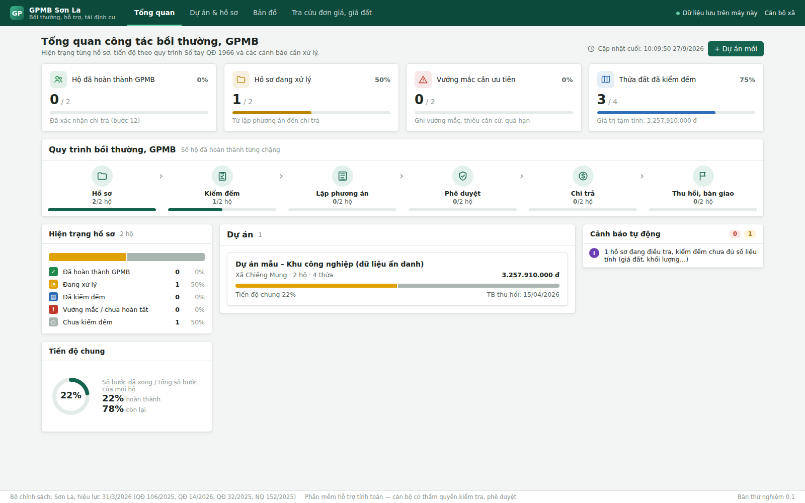
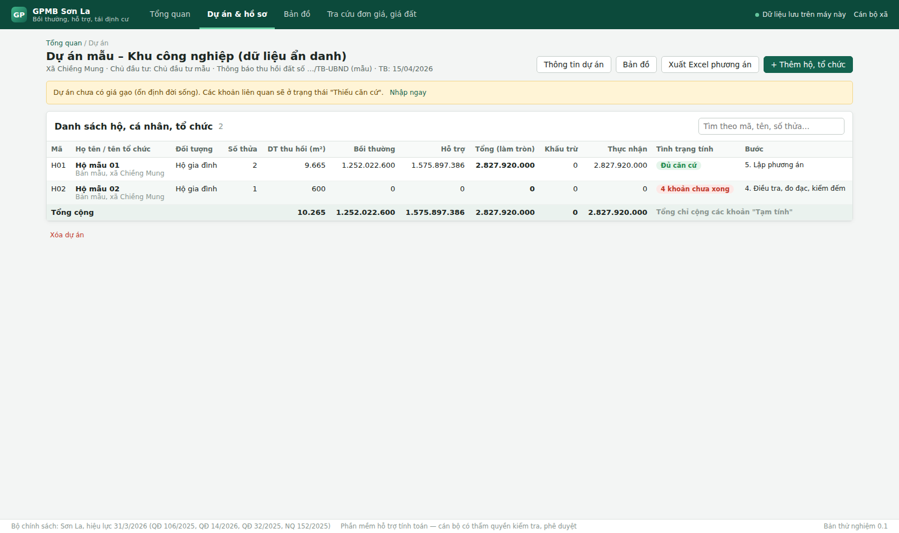
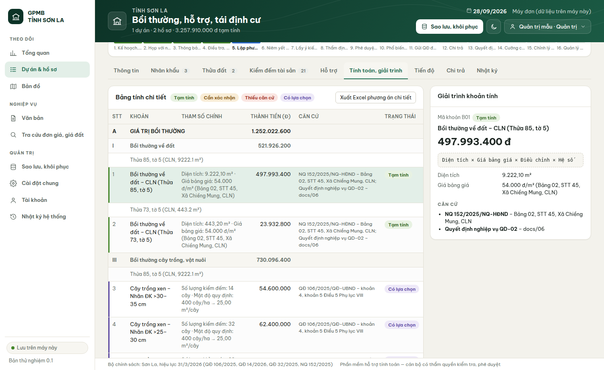
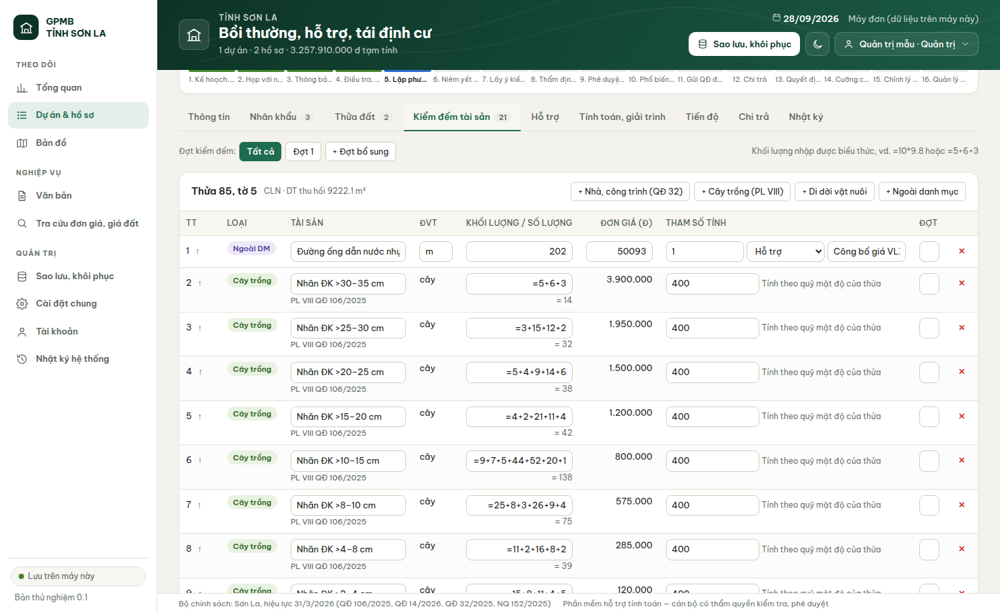
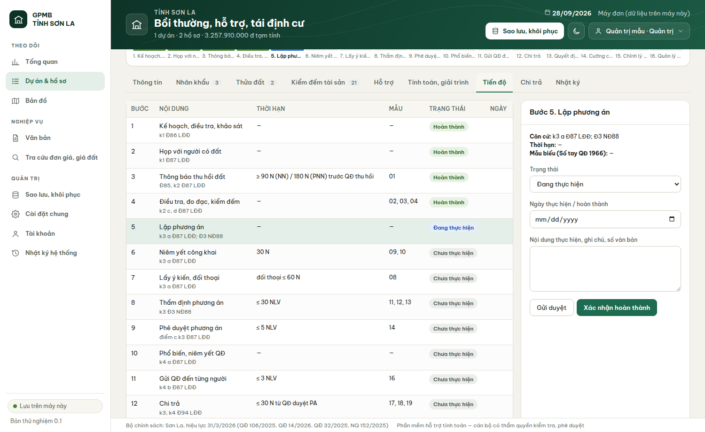

# 09. Ứng dụng desktop – bản thử nghiệm 0.1 (Giai đoạn 3)

## 1. Kiến trúc

```
apps/desktop          Giao diện React + TypeScript (Vite), vỏ Tauri 2 (WebView2) → bộ cài NSIS .exe
  src/tinh-ho.ts      Điều phối tính toán 1 hộ: gọi @gpmb/core, nhóm A/B theo biểu mẫu
  src/kho.ts          Lưu trữ cục bộ (IndexedDB trong WebView2); giao diện Kho để thay SQLite
  src/xuat-excel.ts   Xuất Excel theo cấu trúc biểu áp giá (ExcelJS)
  src/man/*           Màn hình
packages/core         Lõi tính toán (Decimal, dòng tính có giải trình)
packages/gis          Đọc DGN, khép thửa, diện tích thu hồi
policy/               Bộ chính sách + dữ liệu đơn giá, bảng giá đất đã trích xuất
```

Không có máy chủ, không gọi mạng. Vỏ Rust chỉ mở cửa sổ; CSP chặn kết nối ra ngoài (`connect-src 'self'`).

## 2. Tình trạng chức năng

Ký hiệu: **Đã kiểm thử** = có kiểm thử tự động đạt · **Đã chạy** = chạy thử giao diện (Chromium) đạt, chưa có kiểm thử tự động · **Hạn chế** = còn thiếu, nêu rõ.

| Chức năng | Tình trạng | Ghi chú |
|---|---|---|
| Tổng quan: thẻ dự án, tiến độ 16 bước, việc cần xử lý | Đã chạy | |
| Dự án: thông tin (xã, giá gạo, hạn mức, hệ số giá đất có văn bản), danh sách hộ | Đã chạy | Hệ số ≠ 1 bắt buộc ghi văn bản |
| Hồ sơ hộ: thông tin, nhân khẩu, thửa đất, chọn giá NQ 152 | Đã chạy | Giá điều chỉnh (phân lớp, mặt tiếp giáp…) nhập tay kèm căn cứ; **chưa** nối giao diện với `gia-dat.ts` |
| Kiểm đếm theo thửa, theo đợt; chọn đơn giá QĐ 32 / PL VIII; ngoài danh mục có căn cứ | Đã chạy | Khối lượng dạng biểu thức (=10*9.8) — **đã kiểm thử** |
| Tính toán, giải trình từng khoản, trạng thái màu | **Đã kiểm thử** (điều phối) | Hộ mẫu khớp biểu mẫu: đất 521.926.200 đ; CĐN thửa 85 1.493.980.200 đ; cây trồng khớp đến đồng |
| Làm tròn lên nghìn đồng ở cấp hộ; khấu trừ; chỉ cộng khoản "Tạm tính" | **Đã kiểm thử** | |
| Tiến độ 16 bước (Sổ tay QĐ 1966), gửi duyệt/xác nhận, nhật ký | Đã chạy | **Hạn chế:** chưa phân quyền người gửi/người duyệt; chưa tính hạn, cảnh báo quá hạn |
| Bản đồ: nạp DGN, vẽ, chọn ranh GPMB, bảng thửa, cờ nghi vấn | Đã chạy (tệp thật) | Lõi **đã kiểm thử** (docs/08) |
| Tạo hồ sơ từ thửa trong ranh (nhóm theo chủ sử dụng) | Đã chạy (tệp thật: 75 hồ sơ / 501 thửa) | Loại đất giữ ký hiệu bản đồ (1L, 2L…) để cán bộ đổi |
| Xuất Excel: TH ĐẤT, TH GIÁ TRỊ TRÌNH DUYỆT, trang từng hộ | **Đã kiểm thử** (đọc lại tệp, đối chiếu số) | Trang hộ theo cột biểu mẫu: ĐVT, Khối lượng, Hệ số/mức, Đơn giá, Thành tiền, Căn cứ; dòng cây vượt mật độ tách riêng hệ số 0,3; số La Mã nhóm cố định như biểu mẫu. **Hạn chế:** chưa chép định dạng, chữ ký, tiêu đề đúng từng ô của tệp mẫu |
| Tra cứu: QĐ 32, PL VIII, PL V, NQ 152, bộ chính sách | Đã chạy | |
| Xuất Word (Báo cáo thẩm định, QĐ thu hồi, Tờ trình, 22 mẫu Sổ tay) | **Chưa làm** | Giai đoạn 4 |
| Sao lưu/khôi phục, nhiều người dùng mạng nội bộ | **Chưa làm** | |
| Bộ cài Windows `.exe` | **Chưa có** | Xem §3 |

## 3. Đóng gói Windows

- Cấu hình: `apps/desktop/src-tauri` (Tauri 2, NSIS, cài theo người dùng, kèm bộ cài WebView2).
- Build tự động: `.github/workflows/build-windows.yml` chạy trên `windows-latest` → tải bộ cài ở mục Artifacts của lần chạy.
- Môi trường phát triển hiện tại là Linux: **không build được `.exe` tại đây**. Đã build bản Linux (.deb 2,2 MB) và chạy thử trong màn hình ảo: cửa sổ mở, giao diện nạp đúng với CSP chặn mạng ngoài → vỏ Rust và cấu hình Tauri hợp lệ. Bộ cài chỉ được coi là có khi workflow Windows chạy xong và đã được cài thử trên Windows 10/11.
- Chưa kiểm tra trên WebView2: tải tệp Excel (thẻ `<a download>`), thư mục lưu IndexedDB khi gỡ/cài lại.

## 4. Chạy thử trên máy phát triển

```bash
npm install
npm run dev          # mở http://localhost:5173 (trình duyệt), bấm "Nạp dữ liệu mẫu"
npm test             # toàn bộ kiểm thử
cd apps/desktop && npx tauri dev   # cửa sổ desktop (cần Rust + WebView2/WebKitGTK)
```

## 5. Ảnh màn hình (dữ liệu mẫu ẩn danh)

| | |
|---|---|
|  |  |
|  |  |
|  | Màn bản đồ: không đưa ảnh vào kho vì tệp bản đồ mẫu có tên chủ sử dụng thật |
